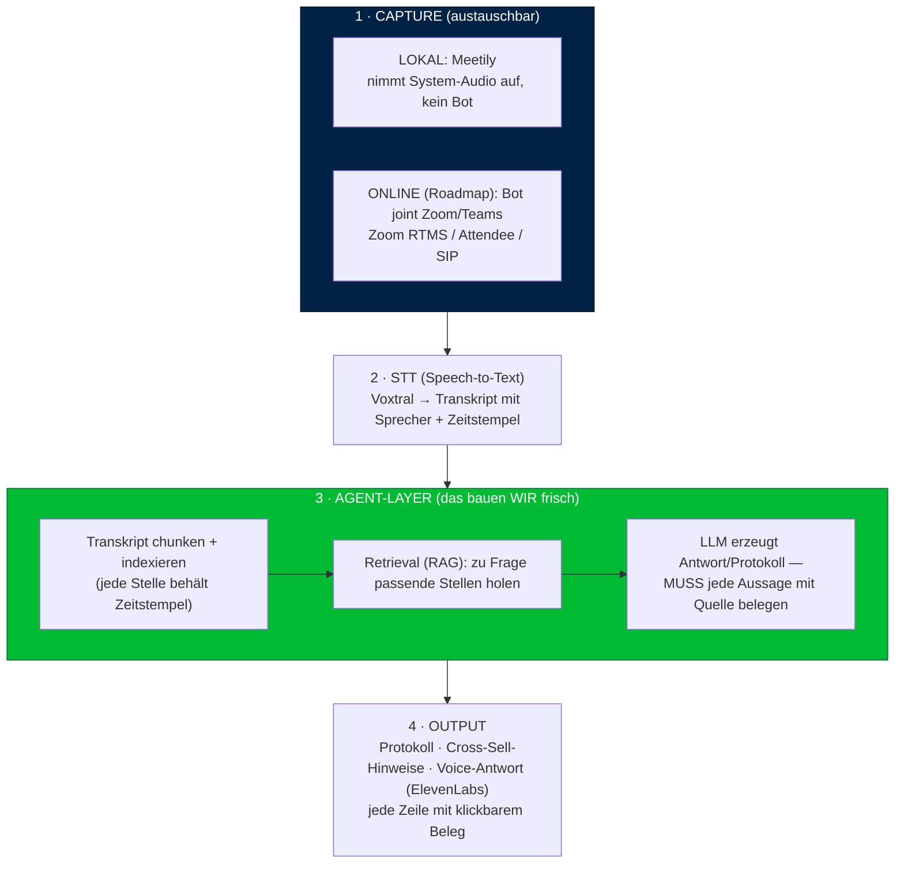
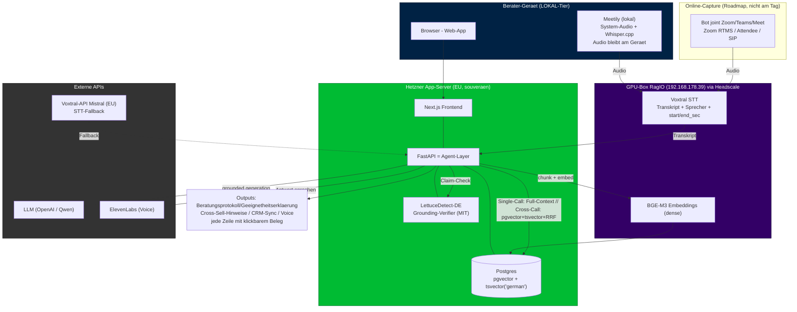

# Architektur-Onboarding für Jacob — Hackathon 06.06. (Hamburg)

Hi Jacob 👋 — das ist dein Self-Contained-Brief: **was wir bauen, wie die Teile zusammenspielen, welche Tech wir nutzen, und die Begriffe, die du noch nicht kennst.** Lies das einmal vor Samstag durch, dann sind wir am Tag sofort produktiv. Fragen vorab sind Gold.

> ⚠️ **CANON-HINWEIS (bei Konflikt gewinnen diese):** Für den **Tag (06.06.)** gelten `00-FINAL-demo-positionierung-build.md` (Positionierung + Demo-Bogen) und `tagesbau-und-prompts.md` (Bau + Rollen + Prompts). Dieses Doc erklärt die **volle Produkt-Architektur** zum Verständnis — **§9/§10 sind Roadmap, NICHT der Tagesbau.** Am Tag konkret: **Voxtral-API** (kein GPU/Headscale), **Full-Context** (kein pgvector/RRF), Demo läuft aus **`demo-transcript.json`** (kein Live-Meetily-Capture), und der **Agent HANDELT** (CRM-Tool-Call + live Plan-Checkliste) — nicht nur extrahieren.

---

## 1. Was wir bauen (in einem Absatz)

Ein **KI-Agent für Finanzberater**, der Beratungsgespräche aufnimmt und danach *agentisch* arbeitet — **kein passiver Notetaker**. Aus jedem Gespräch macht er automatisch das **gesetzlich vorgeschriebene Beratungsprotokoll**, erkennt **Cross-Sell-Chancen** und beantwortet Fragen zum Gespräch — und das **Entscheidende: jede Aussage ist mit der exakten Textstelle belegt** (Sprecher + Zeitstempel, anklickbar). Das senkt das Halluzinations-Risiko und macht das Ding für Haftungsthemen tauglich. Verkaufsversprechen: *„Jedes Gespräch wird zur haftungssicheren Beweisakte UND zur nächsten Verkaufschance."*

**Am Tag (8–9h) bauen wir frisch** (Regel: kein Import von bestehendem Code) **nur den Agent-Layer + die UI**. Die Demo läuft aus dem **vorbereiteten Transkript `demo-transcript.json`** — kein Live-Capture, kein STT auf dem kritischen Pfad. Meetily (Lokal-Capture) und der „Bot geht in fremde Zoom/Teams" sind ehrlich-benannte **Roadmap**, nicht der Tagesbau.

---

## 2. Die vier Layer (so fließen die Daten)

**Merksatz:** Capture und STT sind *gekaufte/Open-Source-Bausteine*. Der **Agent-Layer (3) ist unser Produkt** — da steckt die Arbeit, da steckt der Wert.

---

## 3. Die Komponenten im Detail

| Komponente | Was es ist | Warum / Rolle | Lizenz / Hosting |
|---|---|---|---|
| **Meetily** | Open-Source-Desktop-App (Tauri/Rust + Next.js), die lokal **System-Audio aufnimmt + transkribiert**. Kein Bot — du bist selbst im Call, es hört mit. | Unser **Capture-Fundament** für den Lokal-Modus. Wir bauen drauf auf statt selbst Audio-Capture zu schreiben. | **MIT** (frei kommerziell nutzbar, eigener Code muss NICHT offen sein — nur Copyright-Hinweis mitführen). Läuft on-device. Repo: github.com/Zackriya-Solutions/meetily |
| **Voxtral** | Sprach-zu-Text-Modell von **Mistral (EU)**. Schlägt Whisper-large-v3. | Macht aus Audio das **Transkript mit Sprecher + Zeitstempel**. **Am Tag NICHT auf dem kritischen Pfad** (Demo läuft aus `demo-transcript.json`). | **Apache-2.0** (kommerziell frei). **Tag: Voxtral-API von Mistral (EU, DSGVO).** GPU-Server via Headscale = Roadmap/Produkt. |
| **Agent-Layer** | **Unser frischer Code.** Nimmt das Transkript, indexiert es, beantwortet Fragen + erzeugt das Protokoll — **immer mit Quellenbeleg**. | Das eigentliche Produkt. RAG (Retrieval) + LLM + Zitat-Verankerung + Cross-Sell-Extraktion. | unser Repo, frisch am 06.06. |
| **LLM** | Das Reasoning-Modell hinter dem Agenten (OpenAI/Qwen API — Sponsoren stellen Keys). | Formuliert Protokoll/Antworten *auf Basis der geholten Textstellen*. | API |
| **ElevenLabs** | Text-to-Speech (Stimme). Sponsor. | Der Agent **spricht** die Antwort → „man redet mit ihm". Demo-Wow + zählt als Voice-Agent. | API |

---

## 4. Das Herzstück — Grounding (anti-Halluzination), bitte genau verstehen

Das ist unser Verkaufsargument Nr. 1, also muss der Code es können:

1. Transkript wird in **Chunks** zerlegt, **jeder Chunk behält Sprecher + Start-/End-Zeitstempel**.
2. Bei einer Frage holt **Retrieval** die relevanten Chunks (RAG).
3. Das LLM bekommt die Chunks und die strikte Anweisung: **„antworte NUR auf Basis dieser Stellen und zitiere für jede Aussage die Quelle (Chunk-ID/Zeitstempel)."**
4. Die UI rendert die Antwort **mit klickbaren Belegen** → Klick springt zur Original-Textstelle/Audio.

**Warum das zählt:** Bei Haftungs-/Compliance-Themen sagt jeder zu Recht „aber KI halluziniert". Unsere Antwort ist nicht „vertrau uns", sondern **„hier ist der Beleg, klick drauf"**. Verifizierbarkeit = das, was generische Notetaker NICHT haben. Im Code heißt das: **niemals eine Aussage ohne verknüpfte Quelle ausgeben.**

> 🔑 **Wichtig (MoE-Synthese):** Grounding ist eine *Vertrauens*-Eigenschaft — sie macht uns nicht zum Agenten. Der **demonstrierte Kern** ist, dass der Agent **sichtbar HANDELT** (Plan-Checkliste + ausgeführter CRM-Tool-Call), nicht nur erkennt/zitiert. Details: `00-FINAL-demo-positionierung-build.md`. Und am Tag brauchst du **kein Retrieval/RAG** für die Demo — die 1–2 Transkripte gehen als **Full-Context** in den Prompt (s. §10 „Routing").

---

## 5. Hosting / Infra — was du NICHT machen musst

**Am Tag brauchst du STT gar nicht** — die Demo läuft aus `demo-transcript.json`. STT ist nur relevant, falls wir einen 10-Sek-Live-Capture-Teaser zeigen wollen (optional).

- **Tag-Default (falls STT überhaupt):** **Voxtral-API von Mistral** (EU-gehostet, DSGVO-konform) — eine URL, kein VPN, kein Single-Point-of-Failure.
- **Roadmap/Produkt:** Voxtral auf Phils GPU-Server via **Headscale-Bridge** (s. Glossar). Bau den STT-Aufruf so, dass die **Endpoint-URL aus ENV** kommt — dann ist API↔GPU ein Switch.

---

## 6. Glossar (die Begriffe, die du noch nicht kennst)

- **STT (Speech-to-Text):** Audio → Text. Bei uns: Voxtral.
- **Headscale:** Ein selbst-gehosteter „Steuerkopf" für **Tailscale** (ein WireGuard-Mesh-VPN). Damit erreichen sich Rechner in *verschiedenen* Netzen so, als wären sie im selben privaten LAN. Phil nutzt es, damit unser Code von überall an seinen GPU-Server (Voxtral) drankommt. **Für dich:** nur eine URL hinter VPN — du konfigurierst da nichts.
- **Tailnet / 100.64.x.x:** das private VPN-Netz von Tailscale/Headscale; solche `100.64…`-Adressen sind die Voxtral-Box im VPN.
- **RAG (Retrieval-Augmented Generation):** Statt das LLM frei reden zu lassen, holen wir erst die passenden Textstellen und lassen es **nur daraus** antworten. Basis fürs Grounding.
- **Grounding / Zitat-Verankerung:** jede Aussage ist an eine konkrete Quelle (Textstelle + Zeitstempel) gebunden und anklickbar.
- **Meetily:** s. Tabelle — das lokale Aufnahme-/Transkriptions-Fundament.
- **Voxtral:** s. Tabelle — Mistrals STT-Modell (EU, Apache-2.0).
- **Beratungsprotokoll / Geeignetheitserklärung:** das gesetzlich vorgeschriebene Dokument, das ein Finanzberater nach einem Gespräch erstellen muss (Versicherungsseite §34d = „Beratungsdokumentation" nach VVG; Investmentseite §34f = „Geeignetheitserklärung"). **Pitch-Sorgfalt: die zwei Begriffe nicht verwechseln.**
- **IDD / FinVermV / §34d/§34f:** EU-/DE-Regeln, die diese Dokumentationspflicht vorschreiben. Für dich: der *Grund*, warum der Schmerz echt und Pflicht ist.
- **DSGVO / AVV:** Datenschutz. Wenn wir auf unserem Server verarbeiten, sind wir „Auftragsverarbeiter" und brauchen einen Vertrag (AVV) mit dem Kunden. Lokal-Modus (Meetily) braucht das nicht, weil nichts das Gerät verlässt.

---

## 7. Rollen am Tag (Canon: `tagesbau-und-prompts.md`)

- **Jacob (Hardcore-Coder — baut die App):** Next.js Front + API-Route (LLM-Call mit Phils Prompt) + CRM-Write + ElevenLabs + UI (Plan-Checkliste, Panels, Zitat-Klick) + Hetzner-Deploy.
- **Phil (Pitch + Agent-Hirn + Domäne):** System-Prompts (iteriert mit Claude Code), JSON-Contract + Mock-JSON, Demo-Transkript, Compliance-Inhalte, Deck + Pitch.

> **Schnittstelle = JSON-Contract** (in `tagesbau-und-prompts.md`): Phil liefert Prompt + Mock-JSON → du baust die UI **sofort gegen das Mock**, steckst am Ende den echten LLM-Call rein. **Keiner wartet.**

---

## 8. Was du VOR Samstag tun solltest (~1–2h)

1. **Next.js-Scaffold** schon mal hochziehen (das App-Gerüst, gegen das du Samstag baust). Dev-Env: Node 22, dein Editor (Cursor/Claude Code erlaubt).
2. **`demo-transcript.json` + das Mock-JSON** (JSON-Contract in `tagesbau-und-prompts.md`) anschauen — das ist dein Input + die Datenform, gegen die du die UI baust.
3. **API-Keys** bereitlegen: OpenAI oder Qwen, ElevenLabs; CRM-Sandbox (HubSpot/Pipedrive) anlegen.
4. Lies `00-FINAL-...md` (Demo-Bogen) + `tagesbau-und-prompts.md` (dein Stunden-Plan + Prompts) + diesen Brief.
5. *(Optional, nur falls wir Live-Capture-Teaser zeigen)* Meetily klonen — **nicht** day-kritisch, Demo läuft aus dem Transkript-JSON.

**Ziel:** am 06.06. um 10:00 startest du nicht bei null — Scaffold steht, du baust die UI gegen das Mock, während Phil den Prompt schärft.

---

## 9. Vollbild-Architektur (PRODUKT/ROADMAP — NICHT der Tagesbau)

> Das ist die volle Produkt-Vision zum Verständnis. **Am Tag gebaut wird nur:** Next.js + 1 LLM-Call (Full-Context) + CRM-Write + ElevenLabs, Input = `demo-transcript.json`. Voxtral-GPU/Headscale, pgvector/RRF, BGE-M3, LettuceDetect, Hetzner-DB = Roadmap.

### Deployment-Topologie
- **Hetzner App-Server (EU, Nürnberg/Falkenstein):** eine VM, Docker-Compose — FastAPI (Agent-Layer) + Next.js + Postgres (pgvector + tsvector). Das ist auch die **gehostete Preview-URL** für die Hackathon-Abgabe (bevorzugt). Souveränitäts-Story: alles in EU.
- **GPU-Box (RagIO):** trägt Voxtral (STT) + optional BGE-M3-Embeddings, erreichbar via Headscale. **Fallback Voxtral-API von Mistral (EU)** — per ENV-URL umschaltbar.
- **Berater-Gerät:** Lokal-Tier (Meetily) für maximale Souveränität; oder einfach Browser gegen die Web-App.
- **Externe APIs:** LLM (OpenAI/Qwen), ElevenLabs (Voice). Alles EU-fähig bzu halten ist die Compliance-Linie.

---

## 10. Retrieval & Grounding — PRODUKT-Spec (Roadmap; am Tag: Full-Context, kein Retrieval)

> ⚠️ **Für den Tag NICHT bauen** — die Demo läuft mit Full-Context (1–2 Transkripte in den Prompt, s. „Routing"). Diese Spec ist die Produkt-Roadmap, falls der Korpus wächst. Optional pgvector-dense, wenn Zeit übrig (Phils Call) — aber **kein RRF**.

**Basis (alles in einem Postgres):**
- **pgvector** (dense) + **tsvector(`'german'`)** (Volltext/Keyword) + **RRF**-Fusion in SQL (~30 Zeilen). Benchmark ~84 % Precision — der Sweet-Spot.
- **Embedding:** BGE-M3 (1024d, MIT, deutsch-tauglich) — oder leichter jina-v2-base-de (768d). **Niemals ein englisch-only-Embedding** (RagIO-SPLADE-Lektion).
- **tsvector MUSS `'german'`** sein (Komposita/Stemming), nicht der Default.
- **Chunk-Schema:** Dialog-Fenster (3–5 Sprecher-Turns, ~300–500 Tokens) mit `speaker`, `start_sec`, `end_sec`. Diese Zeitstempel = Zitat-Substrat fürs Grounding.

**Routing (die große Vereinfachung):**
- **Einzel-Gespräch-Frage** (~3–4K Tokens) → **volles Transkript in den LLM-Context**, kein Retrieval (Anthropic: <200K → in den Prompt). Triviales, perfektes Grounding.
- **Cross-Gespräch-Frage** → pgvector + tsvector + RRF.

**Grounding-Garantie (= der Anti-Halluzinations-Pitch):**
1. LLM antwortet NUR aus den geholten/geladenen Stellen, **zitiert jede Aussage** (chunk-id / `start_sec`).
2. **Refusal-Floor:** findet sich kein Beleg → „dafür finde ich im Gespräch keine Stelle", **nicht erfinden** (RagIO Refusal-Calibration).
3. Optional (Stretch, starker Pitch): **LettuceDetect-DE** (`KRLabsOrg/lettucedect-610m-eurobert-de-v1`, MIT, deutsch, schlägt GPT-Judge um 17 F1) prüft jede Aussage maschinell auf Belegtheit. TinyLettuce-Variante (17–68M) klein genug für inline.

**Bewusst NICHT (RagIO-belegte Anti-Patterns):**
- ❌ **Reranker** — maskiert Upstream-Schaden, am Tag nicht auditierbar.
- ❌ **Multi-Query / HyDE / Query-Expansion** — Berater-Queries sind entity-bound (Namen/Tarife); Paraphrasieren dilutiert den Anker (RagIO: −7,7pp Hit@1).
- ❌ **HHEM** als Halluzinations-Check — English-only, DE-Variante closed. → LettuceDetect-DE.
- ❌ **Qdrant / dedizierte Vector-DB** — Over-Engineering <500K Vektoren (flow.raven-ADR).
- ❌ **3-Level-Hierarchie / Topic-Segmentation** — zu komplex für einen Tag.

**Stretch-Goal wenn Zeit bleibt:** Contextual-Prefix (1–2 Sätze LLM-Kontext pro Chunk via Haiku + Caching, ~$0.01/Meeting) — löst das deutsche Pronomen-Problem (er/sie/das → Name), +49 % weniger Retrieval-Fehler. Das ist der Hebel, NICHT der Reranker.
