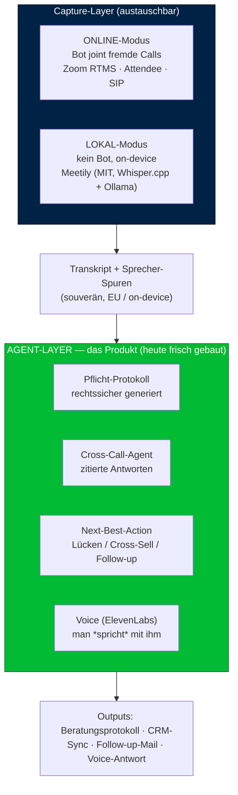

# Hackathon-Prep — flow.raven Agent (Issue #2 Spin-off)

**Event:** AI BEAVERS x Mollie Founder-Hackathon · House of AI Hamburg, Hongkongstraße 2 · **Sa, 06.06.2026, 09:00–21:00**
**Team:** Phil + Jacob
**Hard cut:** Submission 19:00 (Repo + max. 7-Slide-Deck). 3-Min-Live-Pitch, dann Finalisten 3 Min + 2 Min Q&A.

---

> ⚠️ **CANON & STATUS:** Dieses Doc ist die **Strategie-/Markt-Referenz** (Beachhead, Markt-Mathe §2/§2b, Wettbewerb, Checkliste). Was woanders kanonisch lebt — **bei Konflikt gewinnen die:**
> - **Positionierung + Demo-Bogen** → `00-FINAL-demo-positionierung-build.md` (Service-Form, ACT-basiert, Agent *handelt*).
> - **Architektur** → `architektur-fuer-jacob.md`. **Bau + Rollen + Stunden-Plan + Prompts** → `tagesbau-und-prompts.md`.
> - **Überschrieben/migriert:** **ganz §3** (Architektur / Demo-Kern / Stunden-Plan) und die STT-Tier-Notiz (am Tag **Voxtral-API**, kein GPU/Headscale; Demo aus `demo-transcript.json`). Die **Slide-Stichpunkte in §4 sind Roh-v1** — das Deck wird aus `00-FINAL` gebaut.

## 0. Die EINE Sache, an die du dich erinnerst

> **„Die anderen schicken einen Notetaker. Wir schicken einen Agenten."**

**Positionierung (Service-Form — nach MoE-Synthese, s. `00-FINAL-demo-positionierung-build.md`):** *„Wir sind die **Doku- und Compliance-Kraft des Finanzberaters**: jedes Gespräch wird automatisch zur gesetzeskonformen, lückenlos belegten Beweisakte — und über den ganzen Bestand zur abfragbaren Verkaufsintelligenz."* Protokoll = **Einstieg** (Tag-1-Wert); kumulierende Beweisakte + Bestands-Intelligenz = **die Firma** (System-of-Record, den Otter/keasy strukturell nicht nachbauen). Wir ersetzen die **Doku-Arbeit**, nicht den Berater (er haftet).

**First sentence (auswendig):**
> *„Finanzberater verlieren über die Hälfte ihrer Zeit an die Doku nach dem Gespräch — und ein lückenhaftes Protokoll dreht im Streitfall die Beweislast gegen sie. Wir sind ihre Doku-Kraft: jedes Gespräch wird automatisch zur gesetzeskonformen Beweisakte und zur abfragbaren Verkaufschance — lokal, weil US-Notetaker bei Finanzdaten gar nicht antreten dürfen."*

> ⚠️ **Demo-Kern unten ist durch die MoE-Synthese überschrieben** → finaler ACT-basierter Demo-Bogen + Build-Entscheidungen in **`00-FINAL-demo-positionierung-build.md`**. Kernänderung: der Agent muss sichtbar *handeln* (Plan-Checkliste + ausgeführte Tool-Calls), nicht nur erkennen.

---

## 1. Was die Judges bewerten (und wo wir punkten)

| Kriterium | Gewicht | Unser Move |
|---|---:|---|
| Problem + Kunde | 20 % | Finanzberater, Protokollpflicht-Schmerz (1 echten Berater namentlich besorgen) |
| Markt + Business | 20 % | Bottom-up SAM €62M + Doctolib-Expansion (s.u.) |
| Produkt + Demo | 20 % | Agent-Kern live: After-Call-Protokoll + „talk to your calls" |
| AI-native Leverage | 15 % | Agentic (Tool-Use, Retrieval, zitierte Antworten) + Voice (ElevenLabs) |
| Evidence / Founder-Edge | 15 % | HSE-Pitch gehalten, 10 Testkunden, Raven live als Handwerks-Beleg |
| Pitch-Klarheit | 10 % | First sentence + ein Demo-Flow, kein Buzzword |

**Disqualifiziert in 60 s (vermeiden):** „AI [Jobtitel]" ohne Mensch · Feature statt Firma · „X Mrd. Markt" · „für alle" · kein erster Kunde namentlich · Solo · Raven als fertiges Produkt zeigen.

---

## 2. Markt — bottom-up (kein TAM-Theater)

Quelle: DIHK-Vermittlerregister, Stand 01.01.2026.
- Versicherungsmakler §34d(1): **46.885** · Finanzanlagenvermittler §34f: **41.243** · Mehrfachvertreter: **27.072** → unabhängige, selbst-kaufende Berater DE ≈ **115.000**.
- Kern-Beachhead (Makler + §34f, beratungs-/protokoll-intensiv): **~88.000**.
- Pricing-Annahme **€59/Seat/Mo** (€708/Jahr) → **SAM DE ≈ €62 Mio/Jahr** (nur Self-Serve-Kern).
- Traktion-Mathe: 1 % = 880 Berater ≈ **€620k ARR** · 5 % = 4.400 ≈ **€3,1 Mio ARR**.
- **Expansion (Doctolib-Muster):** +98.000 gebundene Vertreter (Versicherer-Deals), +AT/CH, +Anwälte/Steuerberater/Notare, +Call-Center (ACW-ROI = der große Preis).

**Why now:** KI-Agenten-Reife 2026 + Beratungsprotokollpflicht (VVG §6a / FinVermV) als Forcing Function + DSGVO bei Finanzdaten → Sovereign-EU als *Anforderung*.

**Wettbewerb (nie „wir haben keinen"):** Otter/Fireflies/Jamie = *passive* Notetaker, kein Agent, US-Cloud. „Do nothing" = Word-Doku + Gedächtnis. Wir = Agent + souverän + queryable.

---

## 2b. Deep-Research-Belege (04.06.) — die scharfe These

**Drei belegte Säulen** (ersetzen den schwachen „erinnern"-Frame):
1. **Doku-Schmerz:** Makler verbringen **>50 % der Arbeitszeit mit IT/Bürokratie** statt mit Kunden; **65 % wollen die Bürokratie komplett abgeben** — die unbeliebteste Tätigkeit. (Policen Direkt Maklerbarometer 2021, N=411 · DAS INVESTMENT)
2. **Haftung/Beweislastumkehr:** Fehlt/lückt das Protokoll, dreht im Streit-/Storno-/Beschwerdefall die Beweislast — *der Makler* muss korrekte Beratung beweisen, „kommt fast einem Geständnis gleich". Existenzrisiko. (versicherungsrecht-siegen, iww · VVG §§6/6a/61-62)
3. **Cross-Sell ungehoben:** nur **26 %** bündeln bei einem Anbieter, **≥10 % Cross-Sell-Potenzial**; Jahresgespräche „decken auf, wo Lücken entstanden". (asscompact, maklerkonzepte)

**Agent-Use-Cases gerankt** (Schmerz × Frequenz × Zahlungsbereitschaft × Baubarkeit):
1. Auto IDD-/§64-konformes Protokoll/Geeignetheitserklärung aus dem Gespräch → **= Demo-Kern**.
2. Audit-proof Beweiskette gegen Beweislastumkehr (Haftungs-„Versicherung").
3. Bedarfslücken-/Cross-Sell-Erkennung aus dem Gesprächsinhalt → CRM-Trigger.
4. Jahresgespräch-/Review-Vorbereitung (Bestand reaktivieren, ESG-Recheck).

**Why-now:** IDD (Doku-Pflicht jedes Gespräch), FinVermV-Aufzeichnungspflicht + Geeignetheitserklärung (seit 2020, 10 J. Aufbewahrung), **ESG-Abfragepflicht seit 02.08.2022** → mehr Pflichtfelder. DSGVO → lokales Whisper ist **Branchen-Best-Practice** (= Meetily-Lokal-Modus ist Verkaufsargument). BaFin erlaubt KI (Mensch verantwortlich, KI transparent gelabelt).

**Wettbewerbslücke:** Jamie/audalio = nicht branchenspezifisch (kein IDD-/§64-Template, keine Beweiskette). MVPs (keasy, Professional works, AMS/Acturis >50 % Markt) erzeugen Protokolle nur als manuell auszufüllendes Template — **sie hören nicht zu**. Pioniere = DIY Whisper+Claude. → Lücke = integriert, agentisch, compliance-native, lokal.

**Distribution:** Maklerpools (Fonds Finanz, JDC, blau direkt, Maxpool, BCA, Netfonds) bündeln/vertreiben Software an angebundene Makler = Kanal (1 Deal = tausende Makler). **Risiko:** Lock-in — Pools drängen Partner in eigene Prozesse / könnten eigene KI bauen. Pool-Gespräch muss das klären.

**Terminologie (Pitch-Sorgfalt):** §34f-Investmentseite seit 2020 = **„Geeignetheitserklärung"**, nicht „Beratungsprotokoll". Versicherungsseite (§34d) = Beratungsdokumentation (VVG). Beide sauber benennen.

**Noch zu verifizieren:** „1h→10 Min pro Gespräch" nur Vendor-Schätzung (mit eigenen Interviews belegen); Maklerbarometer-Zahlen von 2021 (frischere Welle prüfen); Klage-/Storno-Frequenz pro Makler/Jahr nicht quantifiziert (= ROI des Haftungs-Arguments noch offen).

---

## 3. Was wir am 6. konkret bauen (frisch, ~9h, 2 Personen)

**Regel:** frisches Repo, echte Commits vom Tag, KEIN Raven-Import. Claude Code erlaubt. Open-Source-Pakete (Meetily) + Sample-Transkripte (eigene/synthetisch) sind erlaubt.

### Architektur — zwei Capture-Modi, ein Agent-Hirn (nennen wir konkret im Pitch)
- **Online-Modus** (Bot geht in fremde Calls) — aus Ticket #2: **Zoom RTMS** (`@zoom/rtms`), **Attendee** (Browser-Bot, x86) für Meet/Teams, **SIP Dial-in** (Twilio) als Fallback.
- **Lokal-Modus** (max Souveränität, *kein* Bot, Audio verlässt das Gerät nie) — **Meetily** (MIT-Lizenz, Tauri/Rust, Whisper.cpp/Parakeet lokal, Ollama lokal, 12,5k★). DSGVO/Schweigepflicht-Mode für regulierte Berufe.
- **Agent-Layer (= unser Produkt, heute frisch gebaut):** Protokoll-Generierung + Cross-Call-Query + Voice. Läuft auf beiden Modi.

Das beantwortet Slide-3-Frage „mehr als ein Wrapper?": Capture-Substrat (OSS/Plattform-APIs) + eigenes Agent-Hirn. **Der Anti-Bot-Punkt:** andere schicken einen passiven Notetaker, dessen Output tot in der Schublade landet (→ Kai-Anker, Slide 5). Wir schicken den Agenten, der mit dem Output *etwas tut*.

**STT/Hosting-Tier (entschieden):**
- **Server-Default:** **Voxtral** auf Phils GPU-Box (RagIO-Server `dave@192.168.178.39`) via **Headscale-Bridge**. Apache-2.0 (kommerziell frei), Mistral/EU-souverän, schlägt Whisper-v3. AVV deckt DSGVO. → Hier gehört Voxtral hin (braucht ~9,5 GB VRAM/GPU, läuft NICHT turnkey auf Berater-Laptops).
- **Lokal-Tier (max. Souveränität, kein GPU):** Whisper.cpp on-device (Meetily) — bescheidenere Qualität, Audio verlässt das Gerät nie.
- ⚠️ **Demo-Risiko (vgl. frühere 100.64.0.2-Unerreichbarkeit):** Headscale-Erreichbarkeit zur GPU-Box **vom Venue-Netz** (Test per Handy-Hotspot) VOR Samstag prüfen. **Fallback (DSGVO-konform):** **Voxtral-API von Mistral** (EU-gehostet) — oder Modal (`voxtral_2602.py`). Live-Demo darf nicht am Heim-LAN hängen.

**Day-Build = Lokal-Modus über Meetily als Capture-Substrat + frischer Agent-Layer.** Demobar OHNE Bot-Plumbing, stärkste Souveränitäts-Story, und Meetily ist MIT-lizenziert (erlaubt). Transparenz im Repo/Pitch: *Capture = Meetily (OSS), Agent-Layer = heute gebaut.* Online-Bot-Join (RTMS/Attendee) = ehrlich benannte Roadmap.

**Demo-Kern (der Differentiator, nicht das Plumbing):**
0. **Das Herzstück — Grounding statt Generieren:** jede Antwort + jede Protokoll-Zeile ist an die **exakte Textstelle** (Sprecher + Zeitstempel) verankert; ein Klick springt zur Quelle. **Verifizierbar → senkt Halluzinationsrisiko → macht KI für Haftungsthemen überhaupt erst tauglich.** Das ist nicht ein Feature, das ist *die* Voraussetzung, dass der Haftungs-Pitch trägt.
1. **Nach dem Call:** Transkript (Meetily lokal) → Agent erzeugt das IDD-/§64-konforme **Protokoll bzw. die Geeignetheitserklärung** + CRM-Felder + Follow-up.
2. **Der Mehrwert-Twist (nicht „erinnern"):** Agent markiert (a) die **haftungssichere Beweiskette** — was geraten + warum, schützt vor Beweislastumkehr im Storno-/Beschwerdefall — und (b) die **erkannten Bedarfslücken/Cross-Sell-Chancen** aus dem Gesprächsinhalt → nächste Verkaufschance. **ElevenLabs-Stimme:** man fragt den Agenten und *hört* die Antwort (Voice-Agent = a16z-2026-Kategorie).

### Stunden-Plan
| Zeit | Phil (Agent/AI + Pitch) | Jacob (Meetily-Integration + UI/Demo) |
|---|---|---|
| 10:00–10:30 | Scope-Lock, Repo init, Rollen | dito |
| 10:30–12:30 | Agent-Kern: Extraktion → Protokoll + CRM + Follow-up (OpenAI/Qwen, lokal Ollama möglich) | Meetily lokal lauffähig, Transkript-Export ins Agent-Repo |
| 12:30–13:00 | Lunch | Lunch |
| 13:00–15:30 | „talk to your calls" Retrieval + zitierte Antworten | Chat-Panel + ElevenLabs-Voice einbinden |
| 15:30–17:00 | EINEN Demo-Flow end-to-end härten (Meetily-Call → Protokoll → Voice-Query) | Demo-Flow stabilisieren |
| 17:00–18:00 | 7-Slide-Deck + 3-Min proben | Preview deployen (falls möglich) |
| 18:00–18:45 | Freeze, Repo aufräumen | Submission vorbereiten |
| 19:00 | **Submit (Repo + Deck)** | |

Commit-Hygiene: kleine, häufige Commits — nicht ein Dump um 18:50 (Repo-Inspektion).

---

## 4. Deck — 7 Slides (jede Folie arbeitet)

1. **Problem + Kunde** — Versicherungsmakler/§34f-Berater: >50 % Zeit für Doku statt Kunden (65 % wollen sie los); lückenhaftes Protokoll dreht im Streit die Beweislast gegen sie. Heute: manuell oder passiver Notetaker.
2. **Lösung + Produkt** — kein passiver Notetaker, ein Agent: jedes Gespräch → haftungssicheres Protokoll + erkannte Cross-Sell-Chance, automatisch, lokal. (QR/Demo)
3. **Why now** — IDD/FinVermV + ESG-Abfragepflicht seit 2022 (mehr Doku-Last) + DSGVO → lokales Whisper = Branchen-Best-Practice; BaFin erlaubt KI. „Kein Spion, ein souveräner Begleiter."
4. **Markt + Wettbewerb** — bottom-up €62M SAM, Expansion zu allen regulierten + Call-Center. Jamie/Otter = nicht branchenspezifisch; MVPs (keasy/AMS) hören nicht zu; Pioniere = DIY. Lücke = compliance-native + lokal. Kanal: Maklerpools (Lock-in-Risiko nennen).
5. **Business + Evidence** — €59/Seat/Mo. **Zwei Evidenz-Typen sauber trennen:**
   - (a) *Founder-Edge / Discovery-Anker:* **Kai** (Consultant, kein Finanzberater) nutzt **Sally** — einen *DSGVO-konformen* Notetaker. Trotzdem Schmerz: seine Transkripte landen irgendwo, tot, ungenutzt. Sein O-Ton steht auf unserer Website (*„Das habe ich so nie gesagt"*). **Pointe: das Problem ist nicht Compliance, sondern dass der Notetaker passiv ist — der Output ist tot.** Genau da setzt der Agent an. (Sonja/Michael/Dietrich = weitere Insight-Quellen; alle KEINE Finanzberater.)
   - (b) *Käufer-Nachfrage für DEN Beachhead:* 1 echter **Finanzberater**, der „wann kann ich testen?" sagt (offen — über Ulf-Netzwerk / Maklerpool besorgen).
6. **GTM** — Maklerpools-Kanal + Ulf-Zinne-Netzwerk (warm), Discovery-Leitfaden vorhanden. Konkreter Kanal, nicht „SEO/viral".
7. **Team** — Phil (Domäne Meeting-Intelligence, Raven live in Prod = Handwerks-Beleg, *nicht* als Hackathon-Demo) + Jacob (Build/Integration). Kontakt.

---

## 5. Dein schwächster Punkt — selbst benennen (Pluspunkt)

> *„Der Live-Join in fremde Zoom/Teams ist heute noch nicht gebaut — der Agent arbeitet auf dem aufgenommenen Gespräch. Der Join ist unser nächster Schritt (Zoom RTMS bzw. Browser-Bot), und so würden wir ihn nächste Woche mit zwei echten Beratern testen."*

Defensiv = schwach. „Hier ist mein Risiko + so teste ich es Montag" = stark.

**Erwartbarer Publikums-Einwand „aber KI halluziniert" (kommt bei Haftung garantiert):** nicht wegreden — *zeigen*. Live aufs Zitat klicken → Sprung zur Original-Textstelle mit Zeitstempel. **„Wir generieren nicht, wir belegen."** Das ist der Zahn, den du ziehst, und genau der Grund, warum unser Ansatz für regulierte Beratung taugt, wo ein generischer Notetaker es nicht tut.

---

## 6. Vor Samstag — Checkliste
- [x] Team (Phil + Jacob)
- [ ] **1 Evidenz-Zeile** schriftlich von einem echten **Finanzberater** („wann kann ich testen?") — über Ulf-Zinne-Netzwerk / Maklerpools / Discovery-Leitfaden. (Kai/Sonja/Michael/Dietrich = Insight-Quelle, NICHT Berater-Nachfrage.)
- [ ] 3–4 Sample-Beratungsgespräch-Transkripte vorbereiten (Input, kein Code).
- [ ] First sentence + 3-Min-Pitch laut üben.
- [ ] API-Keys parat: OpenAI/Qwen, ElevenLabs, ggf. Mollie (Checkout-Folie).
- [ ] **Voxtral-Erreichbarkeit vom Fremdnetz testen** (Handy-Hotspot → Headscale → GPU-Box). Fallback Modal/API vorbereiten.
- [ ] Luma-Registrierung + Ausweis; 09:00 da sein (Intro 09:45).
- [ ] Discord beigetreten (#announcements, #submissions).
- [ ] Naming des Spin-offs entscheiden (damit Deck + Voice-Agent ihn tragen).

---

## 7. Anti-Disqualifier-Check (vor Abgabe durchgehen)
- Namentlicher Käufer? ✓ Finanzberater (1 echten Berater namentlich besorgen — Kai/Sonja/Michael/Dietrich sind Sales-Profis, keine Berater)
- Nicht „für alle"? ✓ Beachhead = regulierte mit Protokollpflicht
- Tätigkeit statt Job? ✓ ersetzt die After-Call-Arbeit, nicht „den Berater"
- Bottom-up statt TAM-%? ✓ 88k × €708
- Frisch gebaut, kein Raven-Import? ✓ (Meetily = OSS-Substrat, Agent-Layer frisch)
- Nicht solo? ✓ Phil + Jacob
- Evidenz: Insight (HSE-Profis) + 1 echter Finanzberater-„will testen"
